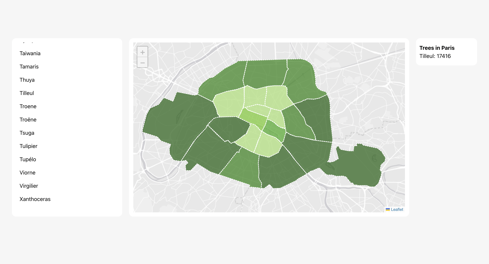
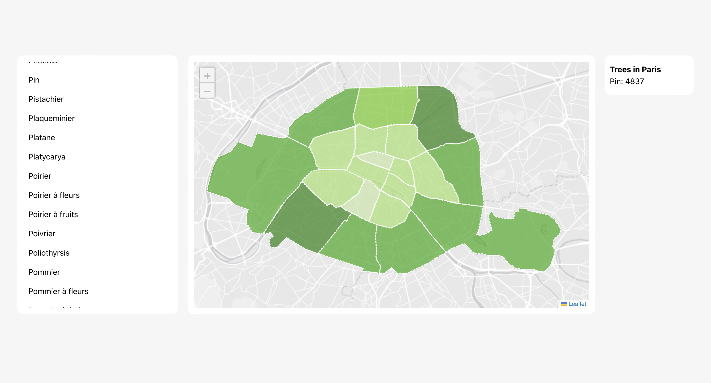
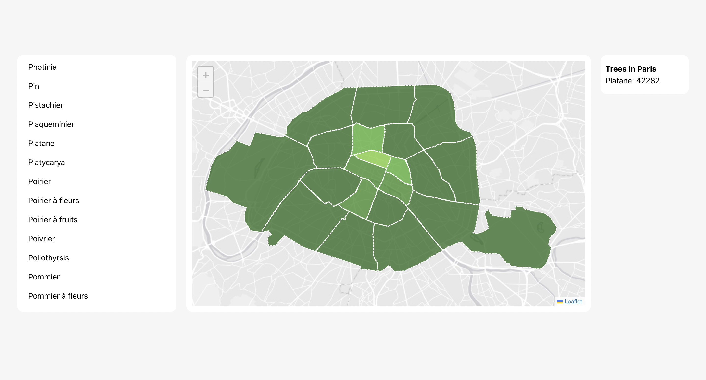

<h1>Trees in Paris Visualizer 🌳</h1>
<h2>Presentation 📝</h2>
This project allows us to see the distribution of various trees in Paris. 
<h2>Technologies used ⚡ </h2> 
<b>Frontend</b>: Angular, <b>Backend</b>: NestJs, <b>Database</b>: PostgreSQL, <b>Leaflet</b>: Map, <b>Other</b>: Docker
<h2>Compilation ⚙️</h2> 
To compile this project, you will only need <b><a href="https://docs.docker.com/engine/install/">docker</a></b> and <b><a href="https://docs.docker.com/compose/install/">docker-compose</a></b>.  

<B>At the project's root:</b>
<pre>docker compose up</pre>                                                                                                                                                                                                 
<h1>Rendering</h1>

